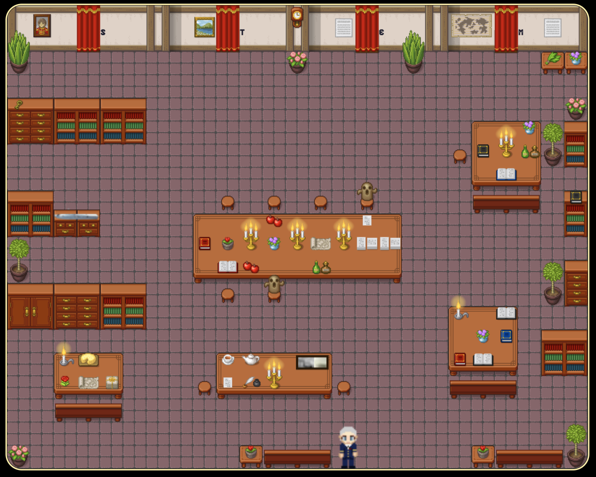

# Hace Gropper

## Introduction
Hace Gropper is a web-based single player top-down educational game where players discover clues inside different rooms to learn more about famous women in STEM.

## Libraries / Technologies
* [Phaser 3](https://phaser.io/)
* [Tiled](https://www.mapeditor.org/)
* [Hexels](https://marmoset.co/hexels/)

## Languages
* JavaScript
* HTML
* CSS

## 

## How to run the game locally

1. Fork and clone this repo.
2. Install dependences with `npm install`.
3. Start build process with `npm run build`.

| Command | Description |
|---------|-------------|
| `npm install` | Install project dependencies |
| `npm start` | Build project and open web server running project |
| `npm run build` | Builds code bundle with production settings (minification, uglification, etc..) |

