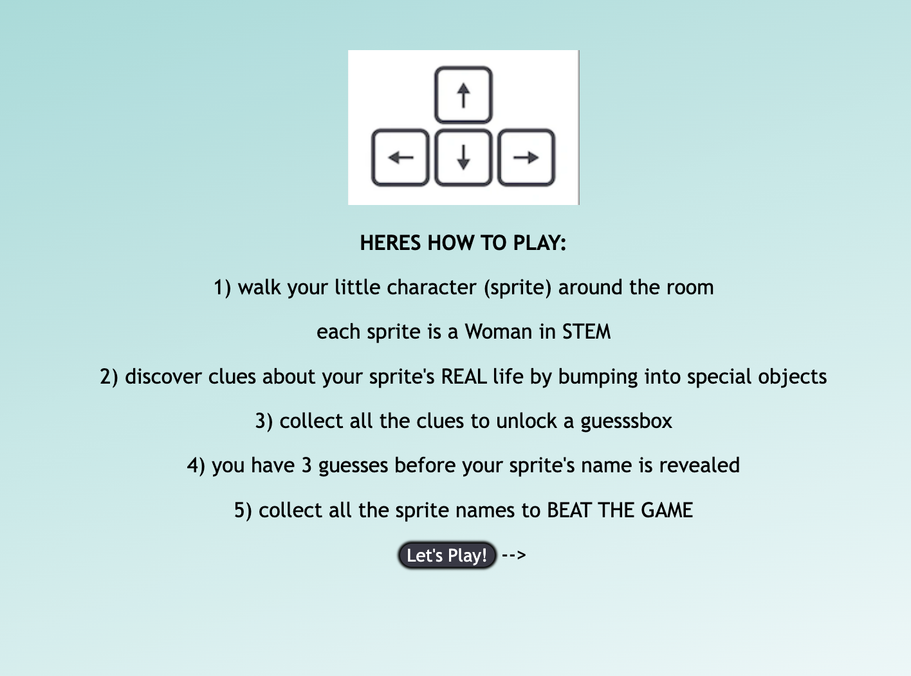
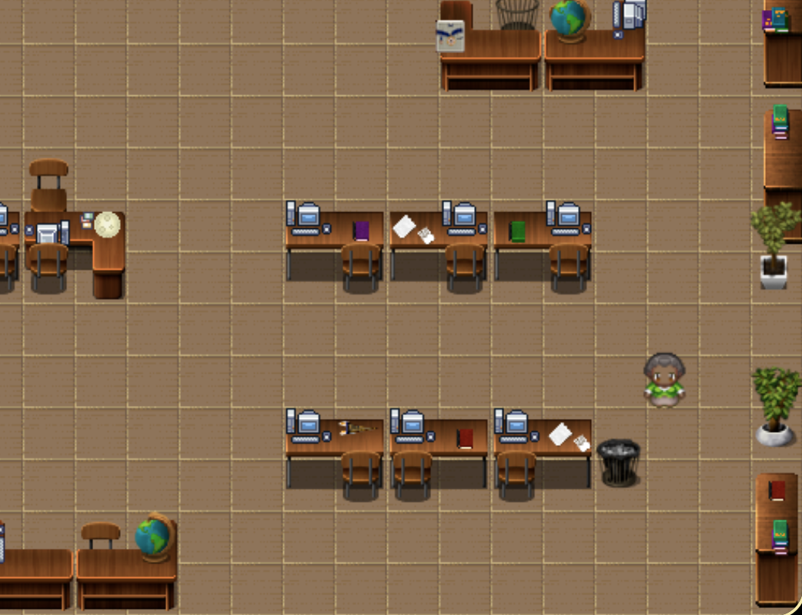
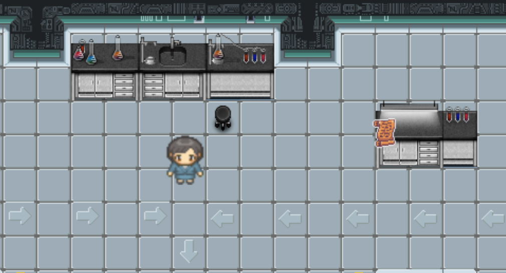
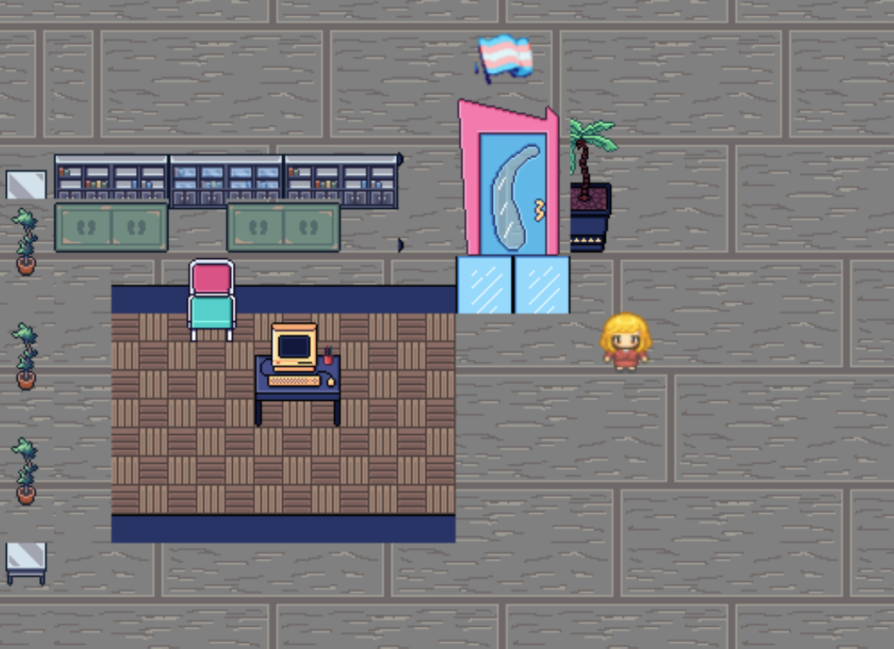
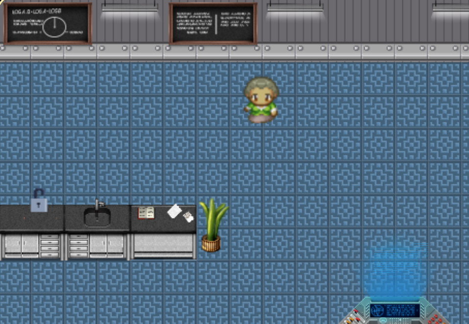

# Hace Gropper

## Introduction
*__Hace Gropper__* is a web-based single player top-down educational game where players discover clues inside different levels to learn more about famous women in STEM.  Players must try to guess their sprite's name while discovering a few surprises along the way!

>Looking for a 60 second summary of our game? Check out this video!

## Tools / Technologies
* [Phaser 3](https://phaser.io/)
* [Tiled](https://www.mapeditor.org/)
* [Hexels](https://marmoset.co/hexels/)
* [TexturePacker](https://www.codeandweb.com/texturepacker)

## Languages
* JavaScript
* HTML
* CSS

## Game Visuals

>How To Play

    

>Discover clues as you explore!

    
    
    
    

## How to run the game locally

1. Fork and clone this repo.
2. Install dependences with `npm install`.
3. Start build process with `npm run build`.

| Command | Description |
|---------|-------------|
| `npm install` | Installs project dependencies |
| `npm start` | Builds project and opens web server running project |
| `npm run build` | Builds code bundle |

